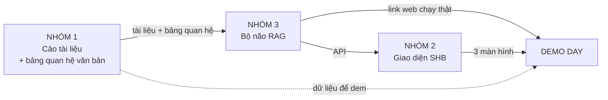

# 📋 GIAO VIỆC 3 NHÓM — Cuộc thi Advanced RAG Knowledge Base (SHB Bank)

> **Ngày:** 18-07-2026
> **Dự án:** knowledge-base (Hệ tra cứu văn bản ngân hàng bằng AI)
> **Loại:** Giao việc / Chiến lược thi đấu
> **Người nhận:** Toàn đội (3 nhóm)
> **⚠️ TÀI LIỆU NỘI BỘ** — không đưa ra ngoài, không đẩy lên repo công khai.

---

## 0. Đọc cái này trước — 1 phút

Chúng ta thi giải AI của **SHB Bank**: xây một hệ **tra cứu văn bản ngân hàng bằng câu hỏi tiếng Việt tự nhiên** (nhân viên gõ câu hỏi thường, AI tìm trong kho quy định rồi trả lời kèm trích nguồn).

**Điều làm giải này KHÓ** (và cũng là chỗ để thắng): văn bản ngân hàng chằng chịt quan hệ với nhau —
- **Dẫn chiếu:** văn bản A nhắc tới Điều X của văn bản B
- **Sửa đổi:** thông tư mới sửa vài điều của thông tư cũ
- **Thay thế một phần:** một số điều khoản bị bỏ, phần còn lại vẫn hiệu lực
- **Mâu thuẫn:** hai văn bản nói ngược nhau

Đề bài viết thẳng: *"các hệ RAG thông thường KHÔNG mô hình hoá được các quan hệ này"*. → **Đội nào làm được 4 thứ trên = thắng. Đó là toàn bộ chiến lược.**

*(RAG = Retrieval-Augmented Generation — AI tra tài liệu rồi mới trả lời, thay vì bịa từ trí nhớ.)*

---

## 1. Cách chấm điểm (100 điểm, 6 tiêu chí)

| Tiêu chí | Điểm | Nhóm nào lo chính |
|---|---|---|
| Chất lượng triển khai kỹ thuật | 20 | Nhóm 3 + Nhóm 1 (dữ liệu thật) |
| **Kiến trúc AI-Native & Đổi mới** | **20** | **Nhóm 3 (phần lõi thắng giải)** |
| Tính khả thi kinh doanh & Lộ trình Pilot | 20 | Nhóm 3 (slide) |
| UX AI-Native & Tư duy thiết kế | 15 | Nhóm 2 (giao diện) |
| An toàn AI, Grounding & Độ tin cậy | 15 | Nhóm 3 |
| Trình bày & Bảo vệ giải pháp | 10 | Nhóm 3 (pitch) |

**3 vòng thi:**
1. **Vòng 1 — AI sơ loại:** máy tự chấm tất cả bài nộp.
2. **Vòng 2 — Giám khảo:** top 30-40 đội, người chấm.
3. **Vòng 3 — Demo Day:** top 10 đội, pitch trực tiếp 4 phút + 2 phút hỏi đáp.

---

## 2. AUDIT — Hệ hiện đang có gì / thiếu gì (tính đến 18-07-2026)

Đội đã có sẵn 1 **bộ khung backend chạy thật** (kho code chung). Nói thẳng để không ai hiểu nhầm mức độ hoàn thành.

### ✅ ĐÃ CÓ (chạy thật, đã kiểm tra)

| Thành phần | Trạng thái |
|---|---|
| Băm tài liệu theo cấu trúc + giữ số trang thật | ✅ `api/chunking.py` |
| Contextual Retrieval (AI dán nhãn ngữ cảnh cho mẩu) + cổng chống bịa | ✅ Có cổng loại câu AI phịa |
| Hybrid search: tìm theo NGHĨA + theo CHỮ, gộp điểm (RRF) | ✅ Chạy trong 1 câu SQL |
| Kho vector pgvector (PostgreSQL) | ✅ `brain_store/` |
| 4 cửa API: nạp / tra / hỏi (có trích nguồn) / soi kho | ✅ `POST /kb/ingest`, `/kb/search`, `/kb/ask`, `GET /kb/stats` |
| Đóng gói Docker — 1 lệnh là chạy cả hệ | ✅ `docker-compose up` |
| Bảo mật (chống SSRF, tiêm lệnh, giới hạn kích thước…) | ✅ Đã audit + vá, xem `SECURITY.md` |
| **Nền móng trục thời gian** (cột `effective_date`, `expiry_date`, `is_current`, `superseded_by`, `review_status`) | ⚠️ **Cột đã dựng sẵn trong DB nhưng CHƯA có code đọc để lọc** — móng đã đổ, chưa xây nhà |

### ❌ CHƯA CÓ — và đây là phần chấm điểm cao nhất

| Việc | Ai làm |
|---|---|
| **Dẫn chiếu** (tự đi theo văn bản được nhắc tới) | Nhóm 3 |
| **Sửa đổi** (luôn dùng bản mới nhất còn hiệu lực) | Nhóm 3 |
| **Thay thế một phần** (loại điều khoản đã bị bỏ) | Nhóm 3 |
| **Dò mâu thuẫn tự động** (cảnh báo 2 văn bản đá nhau) | Nhóm 3 |
| **Tầng ĐIỀU/KHOẢN** (coi mỗi điều khoản là 1 đơn vị có lý lịch riêng) | Nhóm 3 |
| **Đọc PDF** (hệ mới nhận file chữ `.md`, chưa đọc PDF scan) | Nhóm 3 |
| **Giao diện** (hiện chỉ có trang tài liệu API thô, chưa có màn hình đẹp) | Nhóm 2 |
| **Văn bản ngân hàng thật** để nạp vào demo | Nhóm 1 |
| **Bộ câu hỏi ngân hàng thật** để đo lường | Nhóm 3 |

---

## 3. Ý TƯỞNG LÕI — cả đội phải hiểu

> Bốn "đặc sản" (dẫn chiếu / sửa đổi / thay thế / mâu thuẫn) **KHÔNG phải 4 tính năng riêng**. Chúng là MỘT thứ nhìn từ 4 góc:
>
> **mỗi ĐIỀU/KHOẢN phải là một "sinh mệnh" có lý lịch: sinh ngày nào (hiệu lực từ), chết ngày nào (hết hiệu lực), bị ai giết (bị thay bởi văn bản nào), chỉ tay sang ai (dẫn chiếu), cãi nhau với ai (mâu thuẫn).**

Khi nhân viên hỏi → hệ **lọc thời gian TRƯỚC, tìm nội dung SAU** → điều khoản đã hết hiệu lực **không bao giờ lọt vào tay AI** → AI không thể trả lời sai luật cũ, vì luật cũ còn không được đưa cho nó đọc.

Đây là câu trả lời cho giám khảo khi họ hỏi *"vì sao các anh làm được mà đội khác không?"*.

---

## 4. Sơ đồ 3 nhóm nối nhau



**Nguyên tắc vàng:** Nhóm 1 không chỉ cào *nội dung* luật, mà phải cào cả *quan hệ* giữa các luật. Đó là nhiên liệu cho tính năng thắng giải của Nhóm 3. Thiếu nó, Nhóm 3 có code cũng không có gì để chạy.

---

## 5. NHÓM 1 — Cào tài liệu SHB

### 🎯 Mục tiêu
Gom đủ văn bản luật ngân hàng THẬT, và ghi lại MỐI QUAN HỆ giữa chúng.

### Việc cụ thể

**5.1. Nguồn cào** (tài liệu nội bộ SHB không công khai → dùng nguồn mở):
- `thuvienphapluat.vn` (đầy đủ nhất)
- `sbv.gov.vn` (website Ngân hàng Nhà nước)
- `vanban.chinhphu.vn` (cổng văn bản Chính phủ)

**5.2. Ưu tiên cào "bộ ba vàng" để demo** — chuỗi sửa đổi có thật:
> **Thông tư 39/2016/TT-NHNN** (cho vay) → bị **Thông tư 06/2023** sửa → bị **Thông tư 10/2023** *ngưng hiệu lực một phần* Điều 8.

Đây đúng là ví dụ "thay thế một phần" ngoài đời → quả demo hạ gục giám khảo.
Cào thêm: **Luật Các Tổ chức Tín dụng** (bản 2010 → bản 2024 thay thế).

**5.3. Mỗi văn bản ghi đủ 1 phiếu thông tin (vào Google Sheet chung):**

| Cột | Ví dụ |
|---|---|
| Số hiệu | 39/2016/TT-NHNN |
| Tên đầy đủ | Thông tư quy định về hoạt động cho vay... |
| Cơ quan ban hành | Ngân hàng Nhà nước |
| Ngày ban hành | 30/12/2016 |
| **Ngày có hiệu lực** | 15/03/2017 |
| **Ngày hết hiệu lực** (nếu có) | (còn hiệu lực) |
| **SỬA/THAY/NGƯNG văn bản nào** | Sửa Điều 8 khoản 2 của TT... |
| **DẪN CHIẾU tới đâu** | Dẫn Điều 12 TT 41/2016 |
| **Hạng nguồn** | 3=pháp quy NHNN · 2=nội bộ · 1=hướng dẫn |

### 📤 Sản phẩm bàn giao
1. **1 Google Sheet** — mỗi dòng 1 văn bản, đủ các cột trên (đây là "bản đồ quan hệ" Nhóm 3 cần).
2. **1 thư mục file sạch** — mỗi văn bản: giữ bản PDF gốc + 1 bản `.md` chữ thuần (đã bỏ header/footer rác). Nếu ra PDF ảnh scan → báo Nhóm 3.

### ✅ Nghiệm thu Nhóm 1
- [ ] ≥ 30 văn bản đã cào, có file `.md` sạch
- [ ] "Bộ ba vàng" TT 39/2016 + 06/2023 + 10/2023 đủ cả 3
- [ ] Cột "sửa/thay/ngưng văn bản nào" điền đầy đủ (cột quan trọng nhất)
- [ ] Có ít nhất 1 cặp văn bản mâu thuẫn nhau (để demo tính năng dò mâu thuẫn)

---

## 6. NHÓM 2 — Giao diện y hệt SHB

### 🎯 Mục tiêu
3 màn hình, nhìn như sản phẩm thật của SHB (demo cho cảm giác "hệ ngân hàng thật").

### Việc cụ thể

**6.0. Lấy bộ nhận diện SHB (làm trước tiên):**
Vào `shb.com.vn`, chụp màn hình, rút ra: **mã màu chủ đạo, logo, phông chữ, cách bố cục**. → Lấy từ web thật để giống 100%, không đoán.

**6.1. Ba màn hình phải làm:**

| Màn | Làm gì | Gọi API nào |
|---|---|---|
| **1. Nhập liệu** | Kéo-thả file lên, điền phiếu thông tin (số hiệu, ngày hiệu lực, quan hệ), nút "Duyệt" | `POST /kb/ingest` |
| **2. Tra cứu / Hỏi** | Ô gõ câu hỏi → hiện câu trả lời + **trích nguồn** (tên văn bản, trang) + nút xem mẩu gốc | `POST /kb/ask` + `/kb/search` |
| **3. Ba màn "ăn ảnh"** | (a) Dòng thời gian 1 điều khoản (kéo về năm cũ xem quy định lúc đó) · (b) Bản đồ quan hệ văn bản · (c) Thẻ đỏ cảnh báo mâu thuẫn ngay trong câu trả lời | API riêng (Nhóm 3 cấp) |

### 📤 Sản phẩm bàn giao
Web giao diện chạy được, màu/logo/phông giống SHB, gọi vào API Nhóm 3.

### ✅ Nghiệm thu Nhóm 2
- [ ] Màu/logo/phông giống SHB (đối chiếu shb.com.vn)
- [ ] Màn nhập liệu: upload + điền phiếu chạy được
- [ ] Màn hỏi: câu trả lời hiện kèm trích nguồn, bấm xem được mẩu gốc
- [ ] Ít nhất 1 trong 3 màn "ăn ảnh" chạy demo được
- [ ] Hiện đẹp trên máy tính (ưu tiên) + điện thoại

### ⚠️ Lưu ý
Nhóm 2 **không cần biết backend chạy sao** — chỉ cần "hợp đồng API" (mục 8) là làm song song được, không chờ Nhóm 3. Lúc chưa có backend thật thì dùng dữ liệu giả.

---

## 7. NHÓM 3 — Bộ não RAG + Deploy + Thuyết trình

### 🎯 Mục tiêu
Xây phần lõi thắng giải, đưa lên mạng chạy thật, làm bài thuyết trình.

### Mảng A — Bộ não (phần lõi, nặng nhất)
1. **Tầng Điều/Khoản có trục thời gian** — mỗi điều khoản có ngày hiệu lực từ/đến. *Nền móng đã có sẵn trong `db/init/001_schema.sql`, giờ viết code đọc + lọc.*
2. **Bộ trích quan hệ bằng AI** — cho AI đọc văn bản tự rút ra "cái này sửa Điều 8 TT 39/2016" (kết hợp bảng Nhóm 1 cào).
3. **Lọc thời gian TRƯỚC khi tìm** — điều khoản hết hiệu lực không lọt vào tay AI.
4. **Bộ dò mâu thuẫn** — 2 điều khoản cùng hiệu lực, nói ngược nhau → cảnh báo.
5. **Bộ đọc PDF** (nếu Nhóm 1 giao PDF scan).

### Mảng B — Deploy (đưa lên mạng)
- Repo đã có `docker-compose.prod.yml` + `SECURITY.md`. Dựng lên 1 máy chủ (VPS rẻ, hoặc xin credit miễn phí AWS/GCP), gắn tên miền + HTTPS → ra 1 link demo được.
- Làm thêm API cho 3 màn "ăn ảnh" của Nhóm 2.
- **Theo checklist bảo mật trong `SECURITY.md`** trước khi mở công khai (đặt `APP_ENV=prod` + mã bí mật, dựng lớp chắn HTTPS + giới hạn tốc độ).

### Mảng C — Thuyết trình + Video
- **Slide + pitch 4 phút** — kịch bản chốt hạ: 2 màn hình cạnh nhau, cùng 1 câu hỏi. Trái (RAG thường) trả lời bằng luật đã hết hiệu lực → SAI mà nghe hợp lý. Phải (hệ mình) trả lời đúng + cảnh báo *"Điều 8 đã bị ngưng hiệu lực bởi TT 10/2023"* + dòng thời gian.
- **Bộ đo lường** — chạy `scripts/eval_retrieval.py` so hệ mình vs RAG thường, ra bảng số liệu đưa vào slide.
- **Video demo** — quay luồng: nạp văn bản → hỏi → thấy câu trả lời có cảnh báo hiệu lực.

### 📤 Sản phẩm bàn giao
Link web chạy thật + slide + video + bảng benchmark.

### ✅ Nghiệm thu Nhóm 3
- [ ] Hỏi 1 câu về điều khoản đã bị sửa → hệ trả lời bản HIỆN HÀNH + cảnh báo bản cũ
- [ ] Có màn/dữ liệu dòng thời gian của ít nhất 1 điều khoản
- [ ] Dò được ít nhất 1 cặp mâu thuẫn (từ dữ liệu Nhóm 1)
- [ ] Link web công khai chạy được (đã theo checklist `SECURITY.md`)
- [ ] Bảng benchmark: hybrid ăn điểm cao hơn vector ở nhóm câu hỏi có số hiệu văn bản
- [ ] Slide 4 phút + video demo hoàn chỉnh

---

## 8. HỢP ĐỒNG API — điểm nối Nhóm 2 ↔ Nhóm 3

Hai nhóm thống nhất trước để làm song song không chờ nhau. Hệ hiện có:

| Cửa | Việc | Trạng thái |
|---|---|---|
| `POST /kb/ingest` | Nạp 1 văn bản | ✅ Có rồi |
| `POST /kb/search` | Tìm mẩu liên quan (chưa trả lời) | ✅ Có rồi |
| `POST /kb/ask` | Hỏi → trả lời có trích nguồn | ✅ Có rồi |
| `GET /kb/stats` | Xem kho có gì | ✅ Có rồi |
| `GET /kb/timeline/{điều khoản}` | Dòng thời gian 1 điều khoản | 🔲 Nhóm 3 làm thêm |
| `GET /kb/graph/{văn bản}` | Bản đồ quan hệ | 🔲 Nhóm 3 làm thêm |
| cờ "mâu thuẫn" trong câu trả lời | Cảnh báo | 🔲 Nhóm 3 làm thêm |

Nhóm 2 mở `link-demo/docs` là thấy đầy đủ cách gọi 4 cửa đầu, bấm thử được ngay.

---

## 9. Cách chạy hệ ở máy nhà (cho Nhóm 3, và ai muốn thử)

Cần sẵn: **Docker**. Không cần cài Python/PostgreSQL.

```bash
cp .env.example .env
# mở .env điền: KB_DB_PASSWORD (tự đặt) + KB_EMBED_API_KEY (khoá OpenAI)
docker compose up -d --build
# mở http://localhost:8000/docs  → bấm thử API
```

Kiểm hệ sống: `curl http://localhost:8000/health`
Làm lại từ đầu (⚠️ xoá sạch dữ liệu): `docker compose down -v`

---

## 10. Thứ tự bắt đầu — để không ai ngồi chờ

- **Ngày 1, cả 3 nhóm chạy song song:**
  - Nhóm 1: bắt đầu cào + lập Google Sheet
  - Nhóm 2: lấy bộ nhận diện SHB + dựng khung 3 màn hình với dữ liệu giả
  - Nhóm 3: xây tầng điều/khoản + deploy khung rỗng
- **Khi Nhóm 1 giao ~10 văn bản đầu:** Nhóm 3 nạp thật, bắt đầu trích quan hệ.
- **Khi Nhóm 3 có API:** Nhóm 2 đấu nối vào dữ liệu thật.
- **Tuần cuối:** cả đội ghép bài, Nhóm 3 dựng slide + video + tập pitch.

---

## 11. BẢNG NGHIỆM THU TỔNG (ký khi xong)

| Nhóm | Hạng mục chính | Xong? | Người xác nhận |
|---|---|:---:|---|
| 1 | ≥30 văn bản + Google Sheet quan hệ đầy đủ | ☐ | |
| 1 | Bộ ba vàng TT 39/06/10 + 1 cặp mâu thuẫn | ☐ | |
| 2 | 3 màn hình giống SHB, gọi được API | ☐ | |
| 3 | Trả lời đúng bản hiện hành + cảnh báo bản cũ | ☐ | |
| 3 | Link web công khai chạy thật (đã bảo mật) | ☐ | |
| 3 | Slide 4 phút + video + benchmark | ☐ | |

---

_Tài liệu nội bộ. Mọi thắc mắc kỹ thuật về hệ hiện có: đọc `README.md` và `SECURITY.md` trong kho code._
